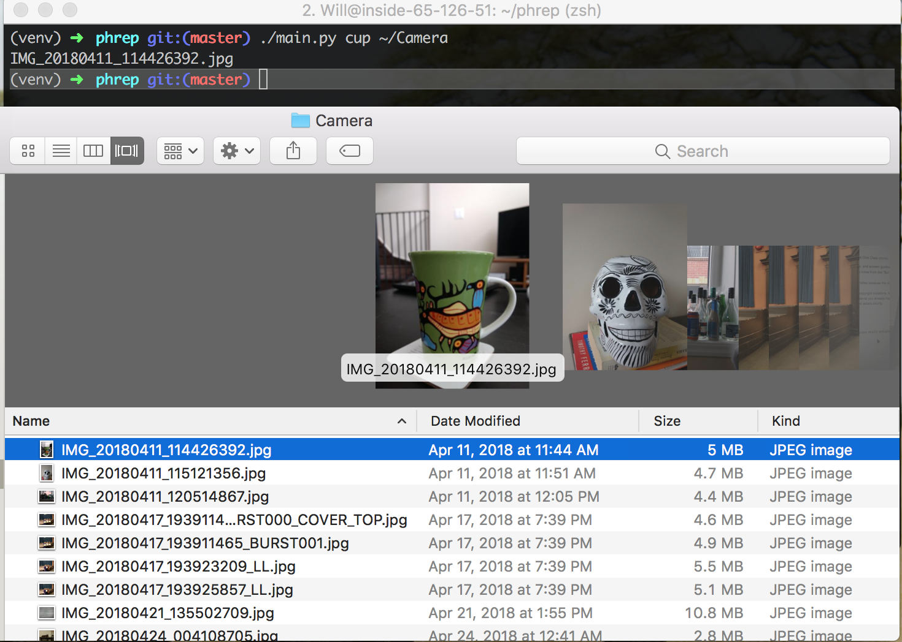

# PHoto GREP

Phrep is command line tool to search photos by visual content usage object recognition.



### Installation

```
pip install requirements.txt
```

### Usage

```
main.py [-h] [--verbose] query path
```
